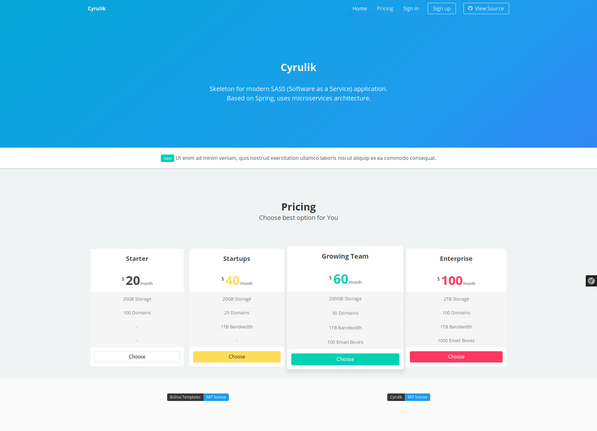
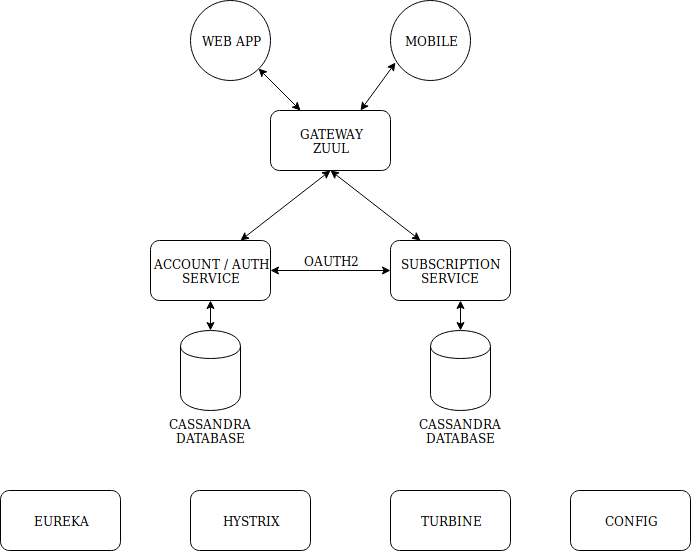

# WIP Cyrulik

Skeleton for modern SASS (Software as a Service) application. Based on Spring, uses microservices architecture.



## Stack

Spring, Docker, Ribbon, Zuul, Turbine, Eureka, Zipkin, Kafka, Redis, Hystrix, Cassandra, Zookeeper, Symfony.

## Infrastructure services

I know diagram is really bad, but my skill in this matter is really low :)



https://www.draw.io/

### Endpoints 

Eureka - http://127.0.0.1:8761/

Gateway - http://127.0.0.1:5002/

Turbine - http://127.0.0.1:8881/

Hystrix - http://127.0.0.1:8882/

Zipkin - http://127.0.0.1:9411/

### Running

First of all prepare all necessary jar files.

```
mvn clean package -DskipTests
```

Run components:

```
docker-compose up -d --force
```

#### Docker images

https://github.com/spotify/docker-maven-plugin

You can push images to Your docker registry, editing `settings.xml`.

Example content:

```xml
<servers>
  <server>
    <id>docker-hub</id>
    <username>foo</username>
    <password>secret-password</password>
    <configuration>
      <email>foo@foo.bar</email>
    </configuration>
  </server>
</servers>
```

### Tools

In folder tools, You will find useful tools to testing app, or her deployment.

## Todo (Random order)

- [x] Docker for services - https://github.com/spotify/docker-maven-plugin
- [ ] Frontend sample app with admin control panel - https://bulma.io/
- [ ] TDD
- [ ] CI
- [ ] Kafka consumer (eg. notifications sent)
- [ ] Register account using social media
- [ ] Security things
- [ ] Fallbacks
- [ ] Consul instead of Eureka (??)
- [ ] Sample mobile apps (Android/IOS) Maybe https://flutter.io/
- [ ] ELK stack

Any ideas? Create PR.
